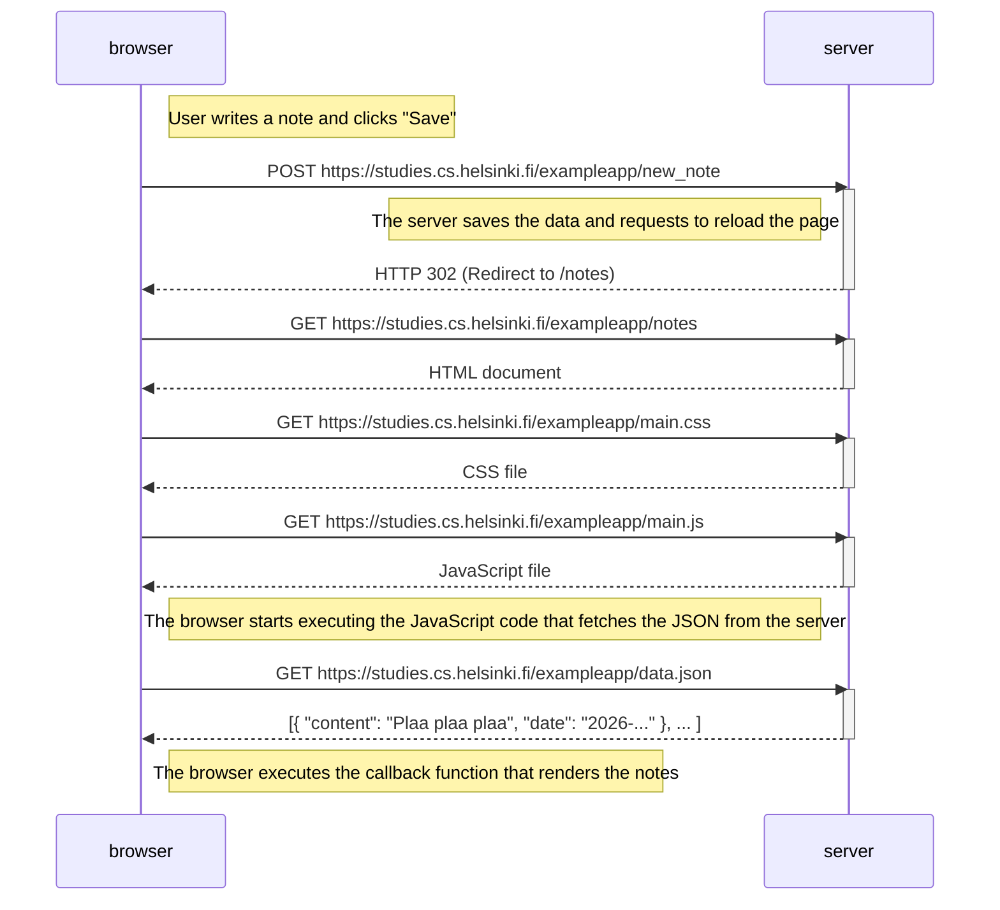

## 0.4: uusi muistiinpano

```mermaid
sequenceDiagram
    participant browser
    participant server

    Note right of browser: User writes a note and clicks "Save"

    browser->>server: POST https://studies.cs.helsinki.fi/exampleapp/new_note
    activate server
    Note left of server: The server saves the data and requests to reload the page
    server-->>browser: HTTP 302 (Redirect to /notes)
    deactivate server

    browser->>server: GET https://studies.cs.helsinki.fi/exampleapp/notes
    activate server
    server-->>browser: HTML document
    deactivate server

    browser->>server: GET https://studies.cs.helsinki.fi/exampleapp/main.css
    activate server
    server-->>browser: CSS file
    deactivate server

    browser->>server: GET https://studies.cs.helsinki.fi/exampleapp/main.js
    activate server
    server-->>browser: JavaScript file
    deactivate server

    Note right of browser: The browser starts executing the JavaScript code that fetches the JSON from the server

    browser->>server: GET https://studies.cs.helsinki.fi/exampleapp/data.json
    activate server
    server-->>browser: [{ "content": "Plaa plaa plaa", "date": "2026-..." }, ... ]
    deactivate server

    Note right of browser: The browser executes the callback function that renders the notes
```
