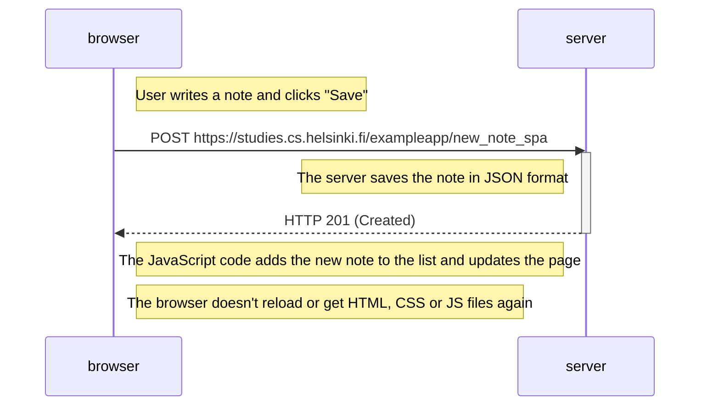

## 0.6: Uusi muistiinpano

```mermaid
sequenceDiagram
    participant browser
    participant server

    Note right of browser: User writes a note and clicks "Save"

    browser->>server: POST https://studies.cs.helsinki.fi/exampleapp/new_note_spa
    activate server
    Note left of server: The server saves the note in JSON format
    server-->>browser: HTTP 201 (Created)
    deactivate server

    Note right of browser: The JavaScript code adds the new note to the list and updates the page

    Note right of browser: The browser doesn't reload or get HTML, CSS or JS files again
```
